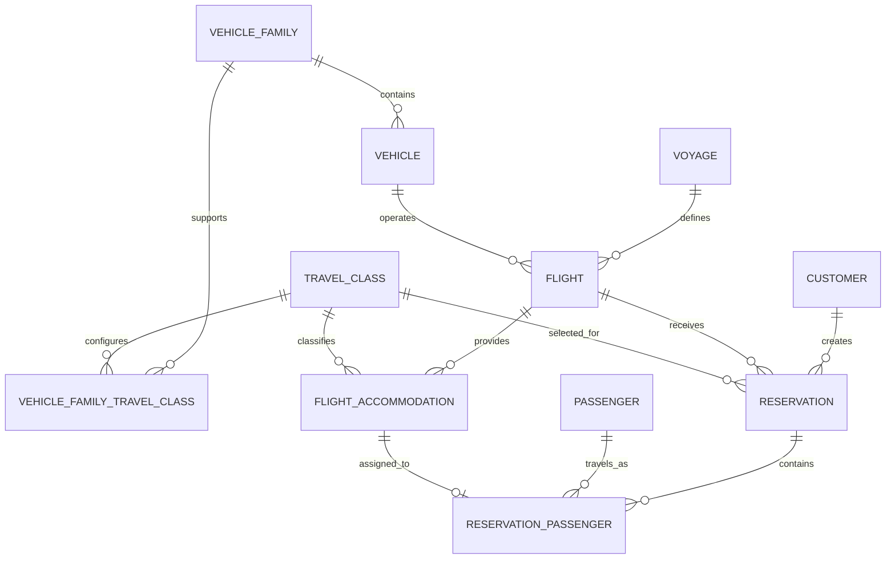

# Voyara Domain Model

Voyara sells scheduled sightseeing voyages that depart from and return to the Voyara Earth Gateway. This document describes the in-memory domain: what each concept means, how the concepts relate, and which business rules the domain objects enforce.

`PRODUCT.md` remains the product source of truth. This layer does not store data, expose an API, or know about Nova.

## Overview

A **voyage** is a reusable experience, such as Ares. A **flight** is one scheduled occurrence of a voyage on one spacecraft. A **reservation** books one customer onto one flight in one travel class. People who travel are **passengers**, and each passenger on a reservation is assigned one **flight accommodation**.

Catalog price for a passenger is the voyage base fare multiplied by the travel class fare multiplier. `Reservation.totalPrice` and `ReservationPassenger.fare` store the amounts charged for that booking. They are snapshots, so a later milestone can introduce flight-specific pricing without changing the meaning of a voyage.

## Identifiers

Each entity has an internal `id` and, where the business names it, a separate `code` or number.

| Field | Role |
| --- | --- |
| `id` | Immutable internal identity. An opaque non-empty string. |
| `code`, `flightNumber`, `confirmationCode` | Business identifier shown to people and operations. |
| `name` | Human-readable display name. |

`createVoyageId` and the other `createXId` functions require a string and brand it. They do not generate identifiers. The application or infrastructure boundary supplies ids. `"voyage-1"` is a valid id; a UUID is also a valid id. The domain does not require UUID format.

Brands exist so a `VoyageId` is not assignable to a `FlightId` at compile time. At runtime every id is still a string.

Uniqueness of business codes is a collection rule. A single entity cannot know whether another voyage already uses `ORB-07`.

## Money and time

Money is an integer number of minor units plus the currency `USD`. `$12,500` is `1_250_000` cents. Amounts must be safe integers greater than or equal to zero. Floating-point money is rejected.

A fare multiplier is a positive integer ratio. Voyager is `1/1`, Voyager+ is `7/5` (1.4×), and Celestial is `5/2` (2.5×). `multiplyMoney` uses integer arithmetic. When a product is not exact, a remainder of half a minor unit rounds away from zero.

`multiplyMoney` is a pricing helper. Creating a reservation does not call it. The stored total and passenger fares are whatever the booking workflow supplies, after those values pass the non-negative check.

Timestamps are ordinary `Date` instants on one UTC timeline. Factories copy them with `new Date(value.getTime())`. There is no Voyara calendar. Callers pass `createdAt` and `updatedAt`.

## Entities

### Voyage

A reusable product: where the spacecraft goes, what passengers experience, the typical duration, and the Voyager-class base fare. A voyage is not a departure.

### Travel class

Domain data for Voyager, Voyager+, and Celestial. Classes are records with a fare multiplier, not an enum, so the catalog can change without a code change. Celestial existing as a class does not mean every spacecraft family offers it.

### Vehicle family

A spacecraft type, such as Odyssey. Capacity is not stored here.

### Vehicle family travel class

The capacity of one travel class on one family. Odyssey plus Voyager is 24. Meridian does not offer Celestial because that family has no Celestial capacity record. A missing row means the class is unavailable. Capacity is not a nullable zero.

### Vehicle

One physical spacecraft, such as Odyssey-02. It belongs to exactly one family.

Status: `ACTIVE`, `MAINTENANCE`, `RETIRED`.

### Flight

One scheduled occurrence of a voyage, operated by one vehicle. It has a flight number, a departure instant, a return instant, and a status.

Status: `SCHEDULED`, `BOARDING`, `DEPARTED`, `IN_FLIGHT`, `RETURNING`, `ARRIVED`, `DELAYED`, `CANCELLED`.

The scheduled window does not have to equal the voyage's typical duration.

### Flight accommodation

One assignable place on one flight, such as `V01`, `P01`, or `C01`. It belongs to one flight and one travel class. It has no `AVAILABLE` or `RESERVED` status. Availability is whether a non-cancelled reservation passenger currently claims it.

### Customer

The person who creates and manages a reservation. The model stores name, email, phone, and timestamps.

### Passenger

A person who travels. A customer may book themselves and other people. Passengers are not customers. The model stores name and timestamps.

### Reservation

A booking for exactly one flight, owned by exactly one customer, in exactly one travel class. Every passenger on that reservation therefore travels in the same class.

Status: `HELD`, `CONFIRMED`, `CANCELLED`, `COMPLETED`.

`HELD` exists so a later milestone can place a temporary inventory hold. This milestone does not expire holds. A held reservation may not have passengers yet. A confirmed reservation should have at least one passenger; that rule needs the reservation and its passenger rows together.

### Reservation passenger

Links one passenger to one reservation and assigns one flight accommodation, with that passenger's fare.

## Domain graph



The accommodation relationship is drawn as zero-or-one because a current claim is exclusive. Cancelled reservation passengers may still point at an accommodation that a later booking uses, so stored history is one-to-many. The enforceable rule is partial uniqueness: at most one reservation passenger whose reservation is not `CANCELLED` may reference a given accommodation.

```text
Voyage
   │
   ▼
Flight ───────────────► Vehicle
   │                       │
   │                       ▼
   │                 VehicleFamily
   │                       │
   │                       ▼
   │           VehicleFamilyTravelClass
   │                       │
   │                       ▼
   │                  TravelClass
   │                       ▲
   ▼                       │
FlightAccommodation ───────┘
   ▲
   │
ReservationPassenger ─────► Passenger
   │
   ▼
Reservation ───────────────► Customer
   │
   ├───────────────────────► Flight
   │
   └───────────────────────► TravelClass
```

## Relationships

- A flight is defined by one voyage and operated by one vehicle.
- A vehicle belongs to one vehicle family.
- A vehicle family supports travel classes through `VehicleFamilyTravelClass`.
- A flight provides many accommodations. Each accommodation has one travel class.
- A reservation is created by one customer, for one flight, in one travel class.
- A reservation contains reservation passengers. Each of those rows names one passenger and one accommodation.
- The assigned accommodation's flight and travel class must be the reservation's flight and travel class.

Every flight still begins and ends at the Voyara Earth Gateway. V1 has a single gateway, so the gateway is not an entity.

## Invariants enforced by a domain object

These checks run inside the factory that creates the object. They do not look at other records.

- Internal ids are non-empty strings.
- Required names, codes, flight numbers, confirmation codes, email, and phone are non-blank.
- `durationMinutes` is an integer greater than zero.
- `capacity` is an integer greater than zero.
- `baseFare`, `totalPrice`, and `fare` are non-negative USD minor units.
- `fareMultiplier` is a ratio of two positive integers, so it is greater than zero.
- `returnAt` is strictly after `departureAt`.
- Vehicle, flight, and reservation statuses belong to their domain sets.
- A reservation stores exactly one `flightId` and exactly one `travelClassId`.
- A vehicle stores exactly one `vehicleFamilyId`.

## Invariants that need more than one object

`assertAccommodationMatchesReservation` enforces the first two when the reservation and the accommodation are both already loaded. It does not search inventory.

- The assigned accommodation belongs to the reservation's flight.
- The assigned accommodation's travel class is the reservation's travel class.
- `totalPrice` should equal the sum of that reservation's passenger fares once the passenger rows exist. The factories do not compare those amounts.
- A confirmed reservation should contain at least one passenger. A `HELD` reservation may contain none while the booking is still being assembled.

## Invariants that need persistence

A single object cannot see the rest of the collection, and these rules need a transaction so two bookings cannot claim the same accommodation.

- Voyage codes are unique.
- Travel class codes are unique.
- Vehicle family codes are unique.
- Vehicle codes are unique.
- Flight numbers are unique.
- A vehicle family and travel class pair is unique.
- An accommodation code is unique within a flight.
- Reservation confirmation codes are unique.
- A reservation and passenger pair is unique.
- An accommodation is assigned to at most one reservation passenger whose reservation status is not `CANCELLED`. `HELD`, `CONFIRMED`, and `COMPLETED` all occupy the accommodation. `CANCELLED` releases it.
- A vehicle is not scheduled on overlapping flights.

Hold expiration, inventory locking, and overlap detection are later milestones.

## What this layer leaves out

PostgreSQL, ORM schemas, seed data, HTTP, authentication, the customer site, the operations dashboard, Nova, payments, and booking transactions are outside this model. The ten voyages, four spacecraft families, and three travel classes in `PRODUCT.md` are future seed data, not constants in the domain.
